<div align="center">

# Hi 👋, I'm Lasse<br><br>&nbsp;[](https://github.com/lassethorlepik/lassethorlepik/actions)&nbsp;[](https://github.com/lassethorlepik/lassethorlepik/actions)<br><br>

</div>

<!--START_SECTION:waka-->


**I'm an Early 🐤** 

```text
🌞 Morning                157 commits         ██░░░░░░░░░░░░░░░░░░░░░░░   09.26 % 
🌆 Daytime                1061 commits        ████████████████░░░░░░░░░   62.60 % 
🌃 Evening                328 commits         █████░░░░░░░░░░░░░░░░░░░░   19.35 % 
🌙 Night                  149 commits         ██░░░░░░░░░░░░░░░░░░░░░░░   08.79 % 
```


📊 **This Week I Spent My Time On** 

```text
💬 Programming Languages: 
Other                    19 mins             █████████████████░░░░░░░░   68.08 % 
Python                   5 mins              ████░░░░░░░░░░░░░░░░░░░░░   17.92 % 
CSV                      4 mins              ████░░░░░░░░░░░░░░░░░░░░░   14.01 % 

🔥 Editors: 
VS Code                  28 mins             █████████████████████████   100.00 % 
```


 Last Updated on 04/04/2026 15:56:13 UTC
<!--END_SECTION:waka-->

<!--START_SECTION:waka-simple-->

```text
From: 27 March 2024 - To: 04 April 2026

Total Time: 1,426 hrs 52 mins

Lua                       417 hrs 39 mins ⣿⣿⣿⣿⣿⣿⣿⣤⣀⣀⣀⣀⣀⣀⣀⣀⣀⣀⣀⣀⣀⣀⣀⣀⣀   29.27 %
Python                    275 hrs 44 mins ⣿⣿⣿⣿⣷⣀⣀⣀⣀⣀⣀⣀⣀⣀⣀⣀⣀⣀⣀⣀⣀⣀⣀⣀⣀   19.32 %
C#                        161 hrs 34 mins ⣿⣿⣷⣀⣀⣀⣀⣀⣀⣀⣀⣀⣀⣀⣀⣀⣀⣀⣀⣀⣀⣀⣀⣀⣀   11.32 %
Blender                   123 hrs 20 mins ⣿⣿⣄⣀⣀⣀⣀⣀⣀⣀⣀⣀⣀⣀⣀⣀⣀⣀⣀⣀⣀⣀⣀⣀⣀   08.64 %
Text                      74 hrs 15 mins  ⣿⣤⣀⣀⣀⣀⣀⣀⣀⣀⣀⣀⣀⣀⣀⣀⣀⣀⣀⣀⣀⣀⣀⣀⣀   05.20 %
Dart                      49 hrs 57 mins  ⣷⣀⣀⣀⣀⣀⣀⣀⣀⣀⣀⣀⣀⣀⣀⣀⣀⣀⣀⣀⣀⣀⣀⣀⣀   03.50 %
```

<!--END_SECTION:waka-simple-->

# Languages and Tools:

**Experience in:**

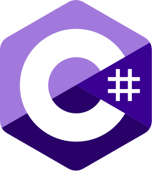&nbsp;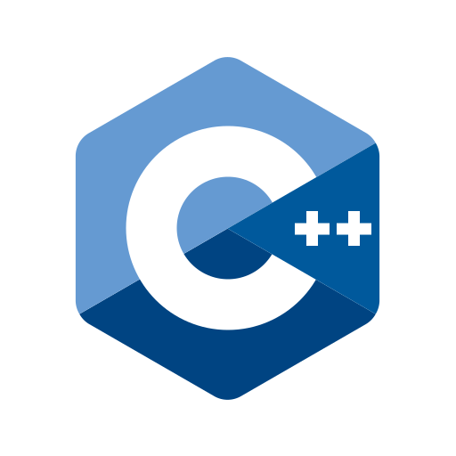&nbsp;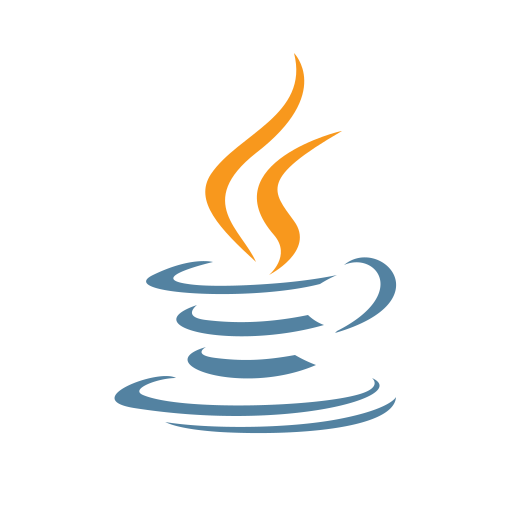&nbsp;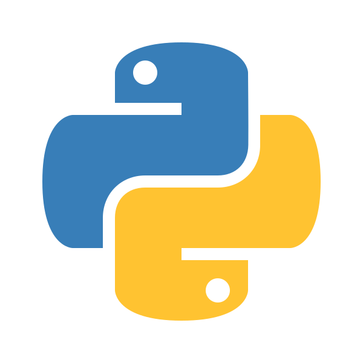&nbsp;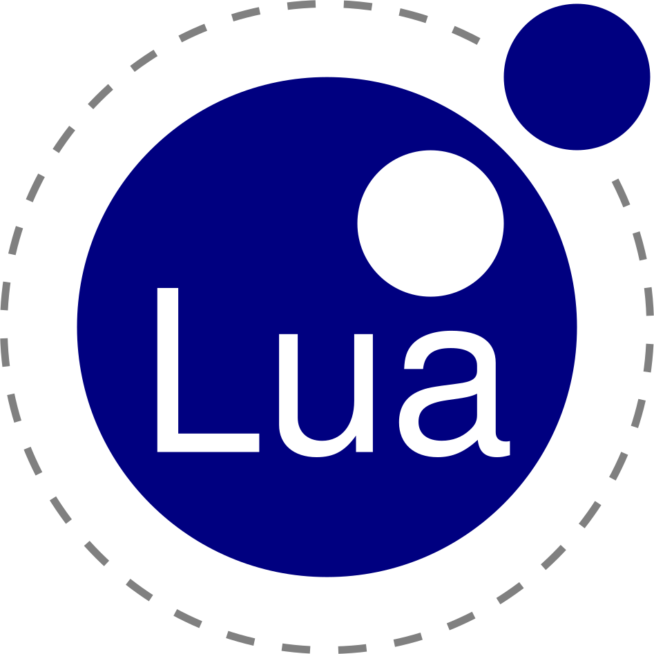&nbsp;&nbsp;&nbsp;&nbsp;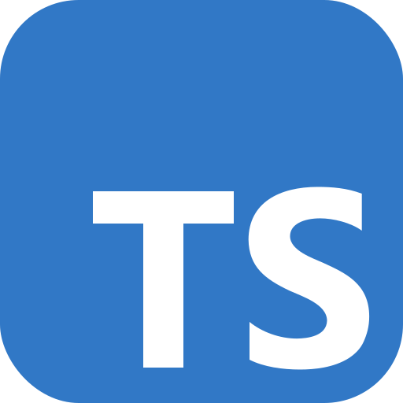

**Tools:**

&nbsp;&nbsp;&nbsp;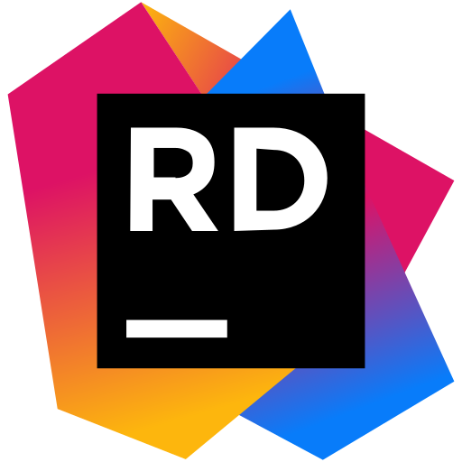&nbsp;&nbsp;&nbsp;&nbsp;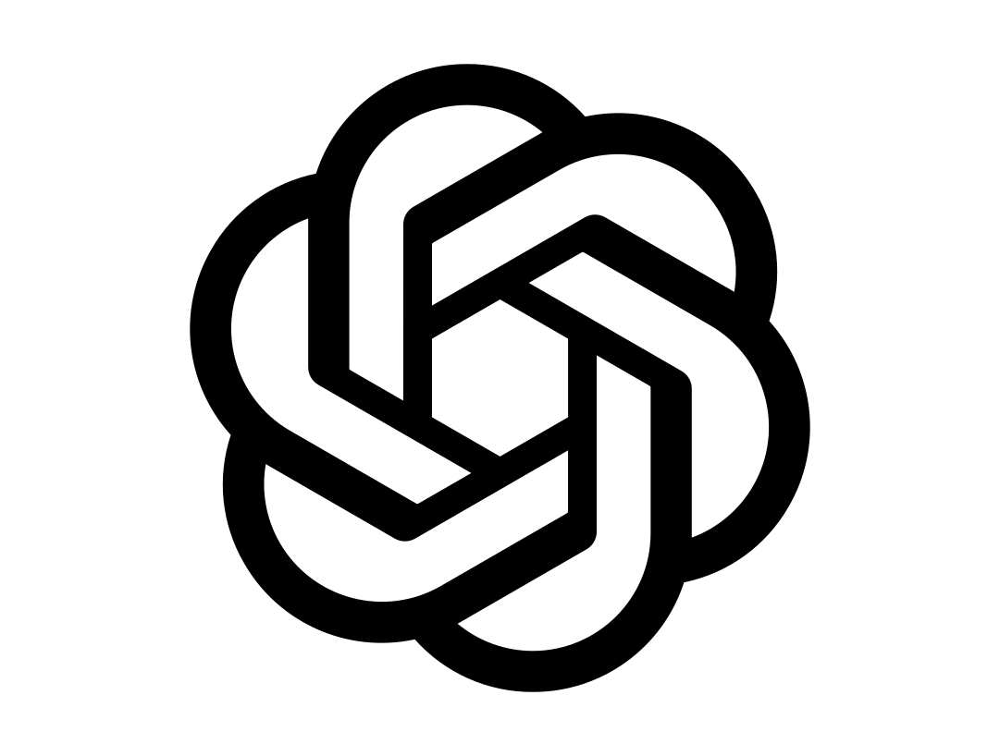&nbsp;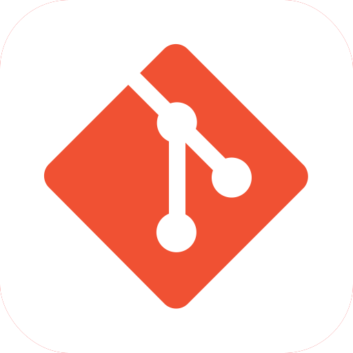&nbsp;&nbsp;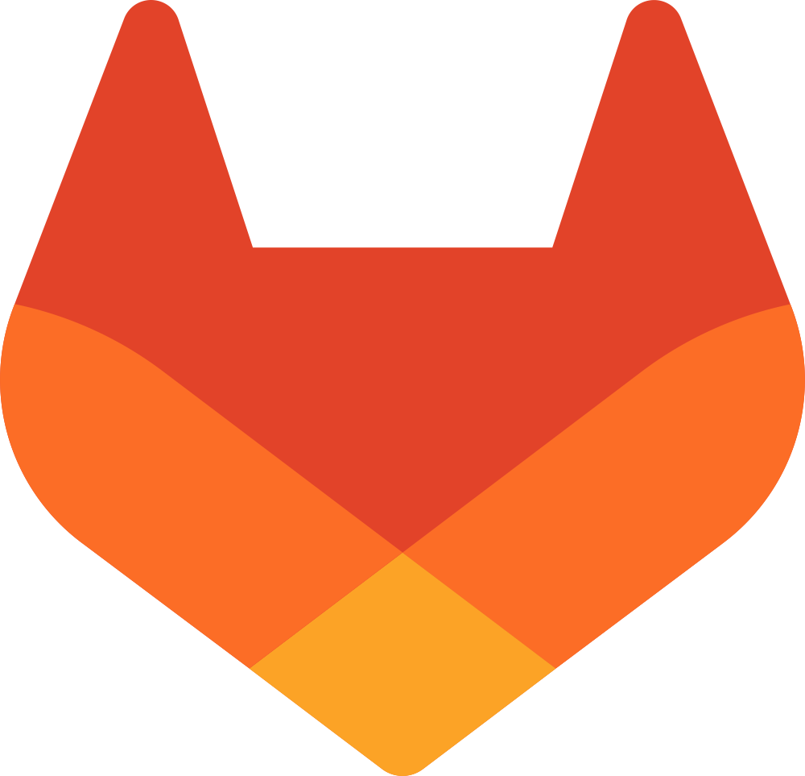&nbsp;&nbsp;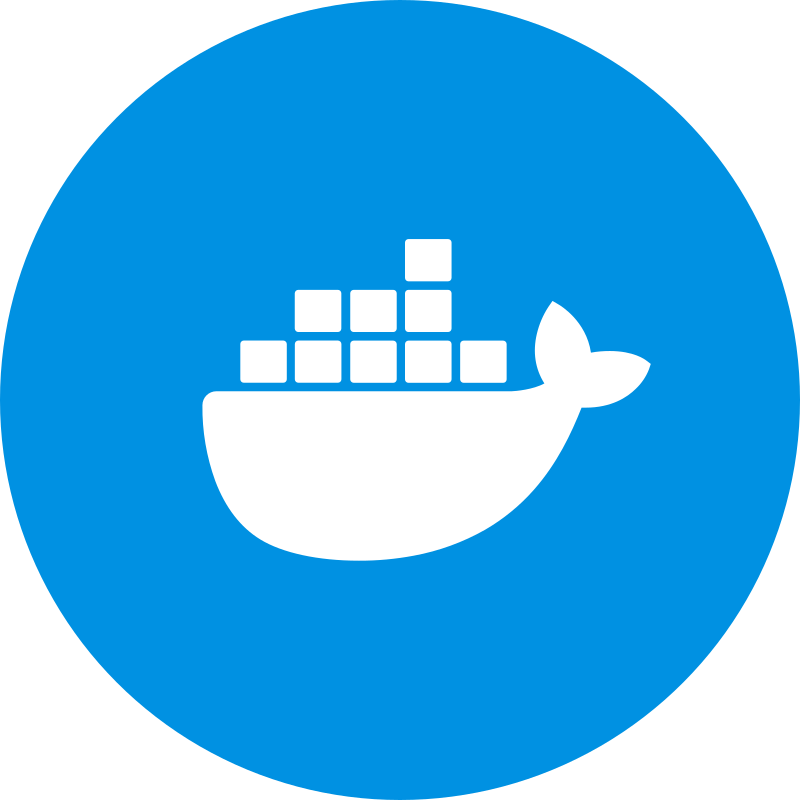&nbsp;&nbsp;&nbsp;&nbsp;&nbsp;&nbsp;

**I also use:**


**Homelab**
| Component | Spec |
|-----------|------|
| CPU | AMD Ryzen 7 5700X |
| RAM | 32 GB DDR4 |
| System Drive | Samsung 980 NVMe |
| Storage Pool | 48 TB RAID-Z2 |
| OS |  |
