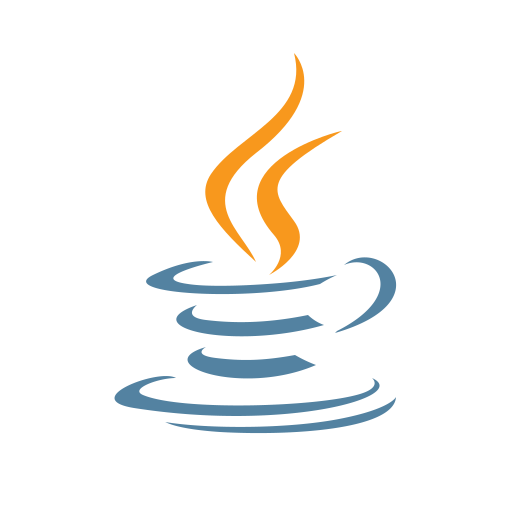

<div align="center">

# Hi 👋, I'm Lasse<br><br>&nbsp;[](https://github.com/lassethorlepik/lassethorlepik/actions)&nbsp;[](https://github.com/lassethorlepik/lassethorlepik/actions)<br><br>

</div>

<!--START_SECTION:waka-->


**I'm an Early 🐤** 

```text
🌞 Morning                142 commits         ███░░░░░░░░░░░░░░░░░░░░░░   11.15 % 
🌆 Daytime                687 commits         █████████████░░░░░░░░░░░░   53.97 % 
🌃 Evening                310 commits         ██████░░░░░░░░░░░░░░░░░░░   24.35 % 
🌙 Night                  134 commits         ███░░░░░░░░░░░░░░░░░░░░░░   10.53 % 
```


📊 **This Week I Spent My Time On** 

```text
💬 Programming Languages: 
Lua                      30 hrs 27 mins      ████████████████░░░░░░░░░   65.41 % 
Blade Template           3 hrs 34 mins       ██░░░░░░░░░░░░░░░░░░░░░░░   07.67 % 
Blender                  2 hrs 51 mins       ██░░░░░░░░░░░░░░░░░░░░░░░   06.15 % 
Text                     2 hrs 42 mins       █░░░░░░░░░░░░░░░░░░░░░░░░   05.81 % 
PHP                      2 hrs 37 mins       █░░░░░░░░░░░░░░░░░░░░░░░░   05.64 % 

🔥 Editors: 
VS Code                  32 hrs 46 mins      ██████████████████░░░░░░░   70.38 % 
PhpStorm                 6 hrs 42 mins       ████░░░░░░░░░░░░░░░░░░░░░   14.39 % 
Notepad++                3 hrs 29 mins       ██░░░░░░░░░░░░░░░░░░░░░░░   07.50 % 
Blender                  2 hrs 51 mins       ██░░░░░░░░░░░░░░░░░░░░░░░   06.15 % 
Rider                    43 mins             ░░░░░░░░░░░░░░░░░░░░░░░░░   01.57 % 
```


 Last Updated on 01/04/2025 15:44:43 UTC
<!--END_SECTION:waka-->

<!--START_SECTION:waka-simple-->

```text
From: 27 March 2024 - To: 01 April 2025

Total Time: 1,168 hrs 38 mins

Lua                       395 hrs 31 mins ⣿⣿⣿⣿⣿⣿⣿⣿⣦⣀⣀⣀⣀⣀⣀⣀⣀⣀⣀⣀⣀⣀⣀⣀⣀   33.84 %
Python                    222 hrs 53 mins ⣿⣿⣿⣿⣷⣀⣀⣀⣀⣀⣀⣀⣀⣀⣀⣀⣀⣀⣀⣀⣀⣀⣀⣀⣀   19.07 %
C#                        117 hrs 16 mins ⣿⣿⣦⣀⣀⣀⣀⣀⣀⣀⣀⣀⣀⣀⣀⣀⣀⣀⣀⣀⣀⣀⣀⣀⣀   10.04 %
Text                      62 hrs 13 mins  ⣿⣤⣀⣀⣀⣀⣀⣀⣀⣀⣀⣀⣀⣀⣀⣀⣀⣀⣀⣀⣀⣀⣀⣀⣀   05.32 %
Blender                   56 hrs 10 mins  ⣿⣄⣀⣀⣀⣀⣀⣀⣀⣀⣀⣀⣀⣀⣀⣀⣀⣀⣀⣀⣀⣀⣀⣀⣀   04.81 %
Dart                      44 hrs 15 mins  ⣿⣀⣀⣀⣀⣀⣀⣀⣀⣀⣀⣀⣀⣀⣀⣀⣀⣀⣀⣀⣀⣀⣀⣀⣀   03.79 %
```

<!--END_SECTION:waka-simple-->

# Languages and Tools:

**Experience in:**

&nbsp;&nbsp;&nbsp;&nbsp;&nbsp;&nbsp;&nbsp;&nbsp;

**Tools:**

&nbsp;&nbsp;&nbsp;&nbsp;&nbsp;&nbsp;&nbsp;&nbsp;&nbsp;&nbsp;&nbsp;&nbsp;&nbsp;&nbsp;&nbsp;&nbsp;&nbsp;&nbsp;

**Game engines:**

&nbsp;&nbsp;

**Operating systems:**


**Cloud services:**


**Other software:**


<br><br>

<span>&nbsp;</span>
